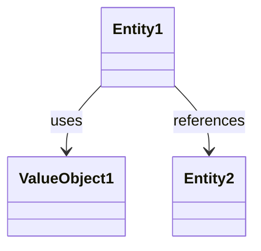

# ドメインモデル: [Unit 名]

## 概要
[このドメインモデルの目的と責務を1-2文で記述]

**重要**: このドメインモデル設計では**コードは書かず**、構造と責務の定義のみを行います。実装はImplementation Phase（コード生成ステップ）で行います。

## エンティティ（Entity）

### [エンティティ名1]
- **ID**: [識別子の型（例: UUID、Integer等）]
- **属性**:
  - [属性名]: [型] - [ビジネス上の意味]
  - [属性名]: [型] - [ビジネス上の意味]
- **振る舞い**:
  - [メソッド名]: [何をするか、ビジネスルール]
  - [メソッド名]: [何をするか、ビジネスルール]

### [エンティティ名2]
（同様に記述）

## 値オブジェクト（Value Object）

### [値オブジェクト名1]
- **属性**: [属性名]: [型] - [説明]
- **不変性**: [なぜ不変であるべきか]
- **等価性**: [何を基準に等価性を判定するか]

## 集約（Aggregate）

### [集約名1]
- **集約ルート**: [エンティティ名]
- **含まれる要素**: [エンティティ or 値オブジェクト] のリスト
- **境界**: [この集約が保護する不変条件の範囲]
- **不変条件**: [常に満たすべきビジネスルール]

## ドメインサービス

### [サービス名1]
- **責務**: [このサービスが担うビジネスロジック]
- **操作**: [操作名] - [何をするか]

## リポジトリインターフェース

### [リポジトリ名1]
- **対象集約**: [集約名]
- **操作**:
  - find(id) - ID で検索
  - save(aggregate) - 永続化
  - delete(id) - 削除
  - [カスタムクエリ名] - [目的]

## ファクトリ（必要な場合のみ）

### [ファクトリ名1]
- **生成対象**: [エンティティ or 集約]
- **生成ロジック概要**: [複雑な初期化処理の説明]

## ドメインモデル図（任意）

構造が複雑な場合のみ、Mermaidで関係図を記述：

## ユビキタス言語

このドメインで使用する共通用語：

- **[ビジネス用語1]**: [定義]
- **[ビジネス用語2]**: [定義]

## 不明点と質問（設計中に記録）

[Question] ドメインモデル設計に関する不明点
[Answer] ユーザーからの回答

（対話を通じて不明点を明確化し、このセクションに記録していく）
